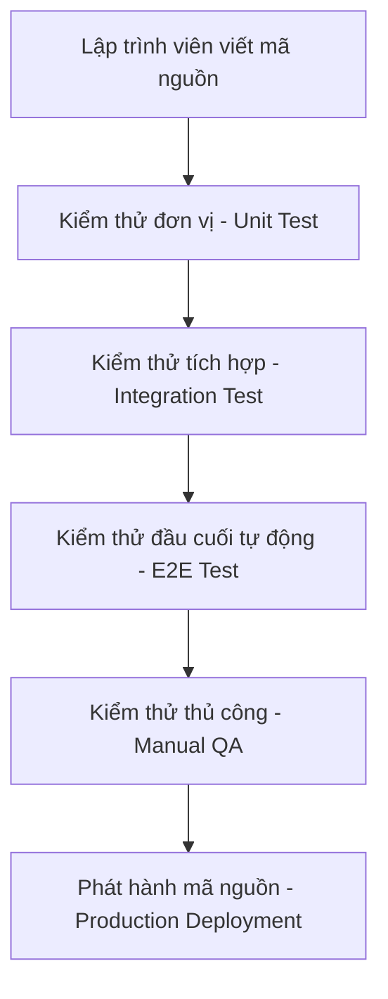

# Tài liệu Logic Nghiệp vụ – Hệ thống LMS (Clone Boot.dev) V2.0

## 1. Tổng quan

Hệ thống là nền tảng học lập trình trực tuyến theo mô hình B2C (Doanh nghiệp tới Người tiêu dùng), trong đó Admin trực tiếp tạo và bán khóa học. Học viên mua khóa học, học qua video/text/quiz, nhận chứng chỉ khi hoàn thành. Phiên bản này bổ sung các cơ chế thực tế: hoàn tiền, phiên bản nội dung, chống gian lận tiến độ, bảo mật video, và quản lý mã giảm giá an toàn.

## 2. Các tác nhân

- **Admin:** Quản trị viên duy nhất, kiêm tác giả nội dung.
- **User (Học viên):** Người dùng đăng ký, mua và học.

## 3. Yêu cầu chức năng chi tiết

### 3.1. Admin

- Quản lý danh mục (phân cấp).
- Quản lý khóa học (thêm/sửa/xóa mềm, thay đổi trạng thái: draft, published, archived).
- Xây dựng nội dung: Chương → Bài học (video/text/quiz). Với video, chỉ lưu ID của dịch vụ stream (Mux/Cloudflare), không lưu URL tĩnh.
- Quản lý quiz: câu hỏi, đáp án, điểm đạt, số lần làm lại.
- Xem & quản lý người dùng (khóa/mở khóa).
- Xem báo cáo doanh thu, tỷ lệ hoàn thành.
- Tạo & quản lý mã giảm giá (giới hạn số lần, thời hạn, khóa học áp dụng).
- Xử lý hoàn tiền (từ giao diện admin hoặc webhook tự động).
- Xem lịch sử phiên bản nội dung khóa học (tùy chọn).

### 3.2. Học viên

- Đăng ký, đăng nhập, quên mật khẩu.
- Duyệt khóa học, xem chi tiết và bài học xem trước.
- Mua khóa học (thanh toán qua VNPayQR / MoMo), áp dụng mã giảm giá.
- Vào khu vực học:
  - Xem video với Signed URL bảo mật, tua video – vị trí tua được lưu liên tục (checkpoint).
  - Đọc bài text.
  - Làm quiz (có thời gian, số lần làm lại), xem kết quả.
- Theo dõi tiến độ: thanh phần trăm hoàn thành, trạng thái từng bài.
- Khi hoàn thành 100% bài học (phiên bản hiện tại của khóa), tự động được cấp chứng chỉ.
- Tải chứng chỉ (có mã xác thực).
- Đánh giá khóa học (1-5 sao) – mỗi user chỉ đánh giá 1 lần.
- Xem lịch sử mua hàng, trạng thái đăng ký (active, revoked, expired).

## 4. Luồng nghiệp vụ chi tiết

### 4.1. Đăng ký & Đăng nhập

- Đăng ký: email, username, password → tạo user (role='user'), gửi email xác thực (tuỳ chọn).
- Đăng nhập: trả về Access Token (15 phút) và Refresh Token (7 ngày, lưu HTTP-only cookie).
- Quên mật khẩu: tạo token trong `password_reset_tokens`, gửi link reset qua email.

### 4.2. Mua khóa học & Áp dụng Coupon (có giữ chỗ)

1. User chọn khóa học, nhấn “Mua ngay”.
2. Nhập mã coupon (nếu có) → Backend kiểm tra: mã có hiệu lực, chưa hết lượt, còn hạn.
3. **Bước giữ chỗ (Atomic):**
   - Trong một transaction:
     - Nếu mã coupon còn lượt (`used_count < usage_limit`), tăng `used_count` lên 1.
     - Tạo bản ghi `enrollments` với:
       - `status = 'pending'`
       - `coupon_id = <id của coupon>`
       - `enrolled_at = NOW()`
4. Backend gọi API VNPay hoặc MoMo để tạo yêu cầu thanh toán (tạo signature bảo mật SHA256/HMAC từ API Secret), trả về đường dẫn thanh toán (`payUrl` của MoMo hoặc `vnp_PayUrl` của VNPay) cho frontend.
5. Frontend chuyển hướng (redirect) người dùng sang trang thanh toán của VNPay/MoMo hoặc hiển thị mã QR Code để người dùng quét thanh toán trên app ngân hàng / ví MoMo.
6. **Hoàn tất thanh toán (IPN & Redirection):**
   - **Xác nhận bất đồng bộ (IPN URL):** Khi thanh toán thành công, cổng thanh toán VNPay/MoMo gửi yêu cầu HTTP POST (IPN) trực tiếp đến Backend. Backend xác thực chữ ký (checksum signature) bảo mật, đối chiếu số tiền (`amount`), mã đơn hàng (`orderId`), nếu hợp lệ thì:
     - Tạo `payment_transactions` (status='completed').
     - Cập nhật `enrollments.status = 'active'`.
     - Trả về phản hồi thành công (`status: 200` hoặc response theo đặc tả cổng thanh toán) để xác nhận đã nhận IPN.
   - **Chuyển hướng phía client (Return/Redirect URL):** Sau khi thanh toán xong, người dùng được chuyển hướng về trang Frontend kèm các tham số giao dịch. Frontend gửi request lên Backend để kiểm tra trạng thái thực tế và hiển thị màn hình chúc mừng.
   - **Nếu giao dịch thất bại:** Nhận IPN báo thất bại hoặc hết thời gian giao dịch, Backend cập nhật `enrollments.status = 'expired'` và **hoàn trả lượt coupon**: giảm `used_count` của coupon đi 1.
7. **Cron Job dọn dẹp:** Mỗi 5 phút, tìm các `enrollments` có `status='pending'` và `enrolled_at < NOW() - INTERVAL '15 minutes'` mà không có payment thành công → chuyển sang `expired` và hoàn lượt coupon.

### 4.3. Học tập & Theo dõi tiến độ (có Checkpoint & Chống gian lận)

- **Frontend:** Khi xem video, mỗi 10 giây gọi `POST /api/lessons/{id}/progress` với `current_time` (số giây).
- **Backend:** Cập nhật `lesson_completions.last_checkpoint_time = current_time`.
- **Hoàn thành bài học:**
  - API `POST /api/lessons/{id}/complete`.
  - Backend kiểm tra:
    1. User có `enrollment` active cho khóa học chứa bài học này.
    2. Nếu là video: `last_checkpoint_time >= (duration_seconds - 5)` – chỉ cho phép hoàn thành khi đã tua đến gần cuối.
    3. Nếu là text: thời gian giữa lần mở đầu tiên và lúc gọi complete tối thiểu bằng `max(text_length/500, 30)` giây.
    4. Nếu là quiz: không được gọi API này, quiz phải được hoàn thành qua API nộp bài.
  - Nếu hợp lệ: ghi nhận `completed_at = NOW()`, `time_spent_seconds = last_checkpoint_time`.
  - Nếu không hợp lệ: trả lỗi 400.

### 4.4. Làm bài Quiz

- User bắt đầu quiz → tạo `user_quiz_attempts` (status='in_progress', started_at).
- Frontend hiển thị câu hỏi, đếm ngược thời gian.
- Khi nộp bài hoặc hết giờ → gọi `POST /api/quizzes/{id}/submit` với danh sách câu trả lời.
- Backend:
  - Chấm điểm, xác định `passed` nếu `score >= passing_score`.
  - Cập nhật attempt: `status='submitted'`, `finished_at`, `score`, `passed`.
  - Nếu passed và là bài quiz thuộc lesson → tự động đánh dấu hoàn thành lesson đó (gọi hàm nội bộ).
- Nếu user đóng trình duyệt đang làm dở → attempt giữ trạng thái `in_progress`, có thể bị đánh dấu `abandoned` bởi cron job sau 1 giờ.

### 4.5. Cấp chứng chỉ

- Điều kiện: User hoàn thành 100% bài học của khóa (tính trên cấu trúc bài học **hiện tại** của khóa).
- Khi đạt:
  - Kiểm tra nếu chưa có certificate cho `enrollment_id` và `is_revoked=false` thì tạo mới:
    - `certificate_code` = UUID ngẫu nhiên, unique.
    - `course_version` = `courses.version` hiện tại.
    - `file_url` có thể sinh sau (PDF).
- Nếu sau này Admin thêm bài học mới (tăng version):
  - User vẫn giữ chứng chỉ cũ, nhưng tiến độ giảm xuống <100%.
  - Họ có thể học thêm bài mới và khi đủ 100% lại, hệ thống sẽ **cập nhật** certificate hiện tại (tăng version, cấp lại code mới) hoặc giữ nguyên tùy chính sách – nhưng mặc định là cập nhật để phản ánh version mới nhất.

### 4.6. Đánh giá khóa học

- User phải có `enrollment` active (hoặc đã hoàn thành) mới được đánh giá.
- Mỗi user chỉ 1 đánh giá cho mỗi khóa học (unique).

### 4.7. Hoàn tiền & Hủy giao dịch

- **Từ Admin:** Admin chọn một giao dịch, nhấn "Hoàn tiền". Hệ thống gọi API hoàn tiền (Refund API) tương ứng của VNPay (gửi yêu cầu hoàn tiền vnp_Api) hoặc MoMo (gửi request type refund) có kèm signature bảo mật.
  - Cập nhật `payment_transactions.status = 'refunded'`.
  - Cập nhật `enrollments.status = 'revoked'`, `revoked_at = NOW()`.
  - Nếu có certificate, đánh dấu `is_revoked = true`.
  - Nếu coupon đã được dùng, **không hoàn lại lượt sử dụng** (vì coupon đã thực sự được dùng để mua, dù sau đó hoàn tiền).
- **Webhook Chargeback:** Tương tự, tự động cập nhật trạng thái revoked.

### 4.8. Cập nhật nội dung khóa học (Versioning)

- Admin chỉnh sửa khóa học đã publish (thêm/xóa/sửa bài học).
- Khi lưu thay đổi, tăng `courses.version` lên 1.
- Tùy chọn: lưu snapshot cấu trúc cũ vào bảng `course_versions`.
- Học viên đang học sẽ thấy tiến độ % tính lại dựa trên tổng số bài mới. Chứng chỉ đã cấp không bị thu hồi nhưng có thể không còn phản ánh đúng version hiện tại (hệ thống khuyến khích học thêm để lấy chứng chỉ cập nhật).

## 5. Mô hình dữ liệu (danh sách bảng & cột quan trọng)

- **users**: id, email, username, password_hash, role, ..., deleted_at
- **password_reset_tokens**: id, user_id, token, expires_at
- **categories**: id, name, slug, parent_id (tự tham chiếu)
- **courses**: id, title, slug, ..., price, status, version, created_by, deleted_at
- **sections**: id, course_id, title, order_index, deleted_at
- **lessons**: id, section_id, title, content_type, content_url (ID video/text), duration_seconds, is_preview, order_index, deleted_at
- **attachments**: id, lesson_id, file_name, file_url, ...
- **quizzes**: id, lesson_id (unique), title, passing_score, time_limit_minutes, max_attempts, deleted_at
- **questions**: id, quiz_id, question_text, question_type, order_index, deleted_at
- **question_options**: id, question_id, option_text, is_correct, order_index
- **enrollments**: id, user_id, course_id, status (active, expired, refunded, revoked), coupon_id, enrolled_at, expires_at, revoked_at
- **payment_transactions**: id, enrollment_id, user_id, amount, currency, payment_method, gateway_transaction_id, status (pending, completed, failed, refunded, disputed)
- **coupons**: id, code, discount_type, discount_value, valid_from, valid_to, usage_limit, used_count, is_active
- **coupon_course**: id, coupon_id, course_id
- **lesson_completions**: id, user_id, lesson_id, completed_at, time_spent_seconds, last_checkpoint_time (unique user_id+lesson_id)
- **user_quiz_attempts**: id, user_id, quiz_id, status (in_progress, submitted, abandoned), started_at, finished_at, score, passed, attempt_number
- **user_answers**: id, attempt_id, question_id, selected_option_id, is_correct (unique attempt+question)
- **course_reviews**: id, user_id, course_id, rating, comment, created_at (unique user+course)
- **certificates**: id, enrollment_id (unique), user_id, course_id, certificate_code, issued_at, file_url, is_revoked, course_version
- **course_versions**: id, course_id, version_number, snapshot_data (JSONB), created_at

Tất cả các bảng chính đều có `deleted_at` để hỗ trợ xóa mềm.

## 6. Quy tắc nghiệp vụ (Business Rules) cập nhật

1. **Tài khoản**: Email, username duy nhất. Mật khẩu hash bcrypt.
2. **Khóa học**: Chỉ admin tạo/sửa. Soft delete không làm mất dữ liệu liên quan. Khi publish lại sau sửa đổi, tăng version.
3. **Bài học xem trước**: `is_preview = true` cho phép xem không cần mua.
4. **Đăng ký**: Mỗi user chỉ 1 enrollment active/revoked cho một khóa học (unique user_id + course_id). `pending` enrollment bị expire sau 15 phút nếu không thanh toán.
5. **Coupon**: Giữ chỗ bằng cách tăng used_count khi tạo pending enrollment. Cron job hoặc webhook thất bại sẽ trả lại.
6. **Tiến độ**: Chỉ user có enrollment active mới được cập nhật tiến độ. Hoàn thành bài học yêu cầu điều kiện thời gian thực tế (checkpoint).
7. **Quiz**: Nếu `max_attempts > 0`, không cho làm quá số lần. Bài làm dở quá 1h sẽ bị đánh dấu abandoned (có thể bị tính là một lần thử nếu cần).
8. **Chứng chỉ**: Mỗi enrollment chỉ 1 certificate không bị thu hồi. Khi hoàn tiền, certificate bị revoke.
9. **Đánh giá**: Chỉ user có enrollment (active hoặc revoked) mới được đánh giá.
10. **Hoàn tiền**: Enrollment chuyển sang revoked, certificate bị revoke, không hoàn lượt coupon.

## 7. Thiết kế API (danh sách rút gọn)

| Method | Endpoint | Mô tả |
|--------|----------|-------|
| POST | /auth/register | Đăng ký |
| POST | /auth/login | Đăng nhập (trả access & refresh token) |
| POST | /auth/refresh | Làm mới access token |
| POST | /auth/forgot-password | Gửi mail reset |
| POST | /auth/reset-password | Đặt lại mật khẩu |
| GET | /courses | Danh sách khóa học (lọc, phân trang) |
| GET | /courses/{slug} | Chi tiết khóa học (kèm bài học preview) |
| POST | /enrollments | Tạo enrollment (pending) + tạo link thanh toán VNPay/MoMo |
| POST/GET | /payments/vnpay-ipn | IPN Callback từ VNPay (xác thực chữ ký, cập nhật trạng thái) |
| POST | /payments/momo-ipn | IPN Callback từ MoMo (xác thực chữ ký, cập nhật trạng thái) |
| GET | /learning/{courseId}/structure | Lấy cây chương/bài học + trạng thái |
| GET | /videos/{lessonId}/playback | Trả về signed URL (hoặc HLS manifest) |
| POST | /lessons/{id}/progress | Cập nhật checkpoint (current_time) |
| POST | /lessons/{id}/complete | Đánh dấu hoàn thành (có validate) |
| POST | /quizzes/{id}/start | Bắt đầu quiz (trả thông tin, tạo attempt) |
| POST | /quizzes/{id}/submit | Nộp bài quiz |
| GET | /certificates | Danh sách chứng chỉ của user |
| POST | /courses/{id}/reviews | Gửi đánh giá |
| (Admin) | /admin/... | Các endpoint quản lý (courses, users, coupons, refunds...) |

## 8. Phụ lục: Script SQL hoàn chỉnh (PostgreSQL)

Script bên dưới tạo mới toàn bộ database với đầy đủ bảng, cột, ràng buộc và index như mô tả ở trên. Bạn có thể chạy trực tiếp.

```sql
-- ============================================
-- LMS Database Schema V2.0 (PostgreSQL)
-- ============================================

-- 1. Users & Auth
CREATE TABLE users (
    id SERIAL PRIMARY KEY,
    email VARCHAR(255) UNIQUE NOT NULL,
    username VARCHAR(100) UNIQUE NOT NULL,
    password_hash VARCHAR(255) NOT NULL,
    role VARCHAR(20) DEFAULT 'user' CHECK (role IN ('admin', 'user')),
    avatar_url VARCHAR(500),
    bio TEXT,
    email_verified_at TIMESTAMP,
    is_active BOOLEAN DEFAULT TRUE,
    created_at TIMESTAMP DEFAULT NOW(),
    updated_at TIMESTAMP DEFAULT NOW(),
    deleted_at TIMESTAMP
);

CREATE TABLE password_reset_tokens (
    id SERIAL PRIMARY KEY,
    user_id INTEGER NOT NULL REFERENCES users(id) ON DELETE CASCADE,
    token VARCHAR(255) UNIQUE NOT NULL,
    expires_at TIMESTAMP NOT NULL,
    created_at TIMESTAMP DEFAULT NOW()
);

-- 2. Categories
CREATE TABLE categories (
    id SERIAL PRIMARY KEY,
    name VARCHAR(100) NOT NULL,
    slug VARCHAR(150) UNIQUE NOT NULL,
    description TEXT,
    parent_id INTEGER REFERENCES categories(id) ON DELETE SET NULL,
    deleted_at TIMESTAMP
);

-- 3. Courses & Content
CREATE TABLE courses (
    id SERIAL PRIMARY KEY,
    title VARCHAR(255) NOT NULL,
    slug VARCHAR(300) UNIQUE NOT NULL,
    short_description TEXT,
    full_description TEXT,
    level VARCHAR(20) DEFAULT 'beginner' CHECK (level IN ('beginner', 'intermediate', 'advanced')),
    price DECIMAL(10,2) DEFAULT 0,
    discount_price DECIMAL(10,2),
    thumbnail_url VARCHAR(500),
    preview_video_url VARCHAR(500),
    status VARCHAR(20) DEFAULT 'draft' CHECK (status IN ('draft', 'published', 'archived')),
    category_id INTEGER REFERENCES categories(id) ON DELETE SET NULL,
    created_by INTEGER NOT NULL REFERENCES users(id) ON DELETE RESTRICT,
    version INTEGER DEFAULT 1,
    created_at TIMESTAMP DEFAULT NOW(),
    updated_at TIMESTAMP DEFAULT NOW(),
    published_at TIMESTAMP,
    deleted_at TIMESTAMP
);

CREATE TABLE sections (
    id SERIAL PRIMARY KEY,
    course_id INTEGER NOT NULL REFERENCES courses(id) ON DELETE CASCADE,
    title VARCHAR(255) NOT NULL,
    order_index INTEGER NOT NULL DEFAULT 0,
    deleted_at TIMESTAMP
);

CREATE TABLE lessons (
    id SERIAL PRIMARY KEY,
    section_id INTEGER NOT NULL REFERENCES sections(id) ON DELETE CASCADE,
    title VARCHAR(255) NOT NULL,
    content_type VARCHAR(20) NOT NULL DEFAULT 'video' CHECK (content_type IN ('video', 'text', 'quiz')),
    content_url TEXT, -- lưu video ID hoặc text
    duration_seconds INTEGER DEFAULT 0,
    is_preview BOOLEAN DEFAULT FALSE,
    order_index INTEGER NOT NULL DEFAULT 0,
    created_at TIMESTAMP DEFAULT NOW(),
    updated_at TIMESTAMP DEFAULT NOW(),
    deleted_at TIMESTAMP
);

CREATE TABLE attachments (
    id SERIAL PRIMARY KEY,
    lesson_id INTEGER NOT NULL REFERENCES lessons(id) ON DELETE CASCADE,
    file_name VARCHAR(255) NOT NULL,
    file_url VARCHAR(500) NOT NULL,
    file_type VARCHAR(100),
    file_size INTEGER
);

-- 4. Quiz
CREATE TABLE quizzes (
    id SERIAL PRIMARY KEY,
    lesson_id INTEGER UNIQUE NOT NULL REFERENCES lessons(id) ON DELETE CASCADE,
    title VARCHAR(255) NOT NULL,
    description TEXT,
    passing_score INTEGER DEFAULT 50,
    time_limit_minutes INTEGER,
    max_attempts INTEGER DEFAULT 0,
    deleted_at TIMESTAMP
);

CREATE TABLE questions (
    id SERIAL PRIMARY KEY,
    quiz_id INTEGER NOT NULL REFERENCES quizzes(id) ON DELETE CASCADE,
    question_text TEXT NOT NULL,
    question_type VARCHAR(30) NOT NULL DEFAULT 'single_choice' CHECK (question_type IN ('single_choice', 'multiple_choice', 'true_false')),
    order_index INTEGER NOT NULL DEFAULT 0,
    deleted_at TIMESTAMP
);

CREATE TABLE question_options (
    id SERIAL PRIMARY KEY,
    question_id INTEGER NOT NULL REFERENCES questions(id) ON DELETE CASCADE,
    option_text VARCHAR(500) NOT NULL,
    is_correct BOOLEAN DEFAULT FALSE,
    order_index INTEGER NOT NULL DEFAULT 0
);

-- 5. Enrollments & Payments
CREATE TABLE enrollments (
    id SERIAL PRIMARY KEY,
    user_id INTEGER NOT NULL REFERENCES users(id) ON DELETE CASCADE,
    course_id INTEGER NOT NULL REFERENCES courses(id) ON DELETE CASCADE,
    status VARCHAR(20) DEFAULT 'active' CHECK (status IN ('active', 'expired', 'refunded', 'revoked')),
    coupon_id INTEGER REFERENCES coupons(id) ON DELETE SET NULL,
    enrolled_at TIMESTAMP DEFAULT NOW(),
    expires_at TIMESTAMP,
    revoked_at TIMESTAMP,
    UNIQUE(user_id, course_id)
);

CREATE TABLE payment_transactions (
    id SERIAL PRIMARY KEY,
    enrollment_id INTEGER NOT NULL REFERENCES enrollments(id) ON DELETE CASCADE,
    user_id INTEGER NOT NULL REFERENCES users(id) ON DELETE RESTRICT,
    amount DECIMAL(10,2) NOT NULL,
    currency VARCHAR(10) DEFAULT 'USD',
    payment_method VARCHAR(50),
    gateway_transaction_id VARCHAR(255),
    status VARCHAR(20) DEFAULT 'pending' CHECK (status IN ('pending', 'completed', 'failed', 'refunded', 'disputed')),
    created_at TIMESTAMP DEFAULT NOW()
);

-- 6. Coupons
CREATE TABLE coupons (
    id SERIAL PRIMARY KEY,
    code VARCHAR(50) UNIQUE NOT NULL,
    discount_type VARCHAR(20) NOT NULL CHECK (discount_type IN ('percent', 'fixed')),
    discount_value DECIMAL(10,2) NOT NULL,
    valid_from TIMESTAMP,
    valid_to TIMESTAMP,
    usage_limit INTEGER DEFAULT 0,
    used_count INTEGER DEFAULT 0,
    is_active BOOLEAN DEFAULT TRUE
);

CREATE TABLE coupon_course (
    id SERIAL PRIMARY KEY,
    coupon_id INTEGER NOT NULL REFERENCES coupons(id) ON DELETE CASCADE,
    course_id INTEGER NOT NULL REFERENCES courses(id) ON DELETE CASCADE,
    UNIQUE(coupon_id, course_id)
);

-- 7. Progress & Learning
CREATE TABLE lesson_completions (
    id SERIAL PRIMARY KEY,
    user_id INTEGER NOT NULL REFERENCES users(id) ON DELETE CASCADE,
    lesson_id INTEGER NOT NULL REFERENCES lessons(id) ON DELETE CASCADE,
    completed_at TIMESTAMP,
    time_spent_seconds INTEGER DEFAULT 0,
    last_checkpoint_time INTEGER DEFAULT 0, -- giây
    UNIQUE(user_id, lesson_id)
);

CREATE TABLE user_quiz_attempts (
    id SERIAL PRIMARY KEY,
    user_id INTEGER NOT NULL REFERENCES users(id) ON DELETE CASCADE,
    quiz_id INTEGER NOT NULL REFERENCES quizzes(id) ON DELETE CASCADE,
    status VARCHAR(20) DEFAULT 'in_progress' CHECK (status IN ('in_progress', 'submitted', 'abandoned')),
    started_at TIMESTAMP DEFAULT NOW(),
    finished_at TIMESTAMP,
    score INTEGER,
    passed BOOLEAN,
    attempt_number INTEGER NOT NULL DEFAULT 1
);

CREATE TABLE user_answers (
    id SERIAL PRIMARY KEY,
    attempt_id INTEGER NOT NULL REFERENCES user_quiz_attempts(id) ON DELETE CASCADE,
    question_id INTEGER NOT NULL REFERENCES questions(id) ON DELETE CASCADE,
    selected_option_id INTEGER REFERENCES question_options(id) ON DELETE SET NULL,
    is_correct BOOLEAN,
    UNIQUE(attempt_id, question_id)
);

-- 8. Reviews & Certificates
CREATE TABLE course_reviews (
    id SERIAL PRIMARY KEY,
    user_id INTEGER NOT NULL REFERENCES users(id) ON DELETE CASCADE,
    course_id INTEGER NOT NULL REFERENCES courses(id) ON DELETE CASCADE,
    rating INTEGER NOT NULL CHECK (rating >= 1 AND rating <= 5),
    comment TEXT,
    created_at TIMESTAMP DEFAULT NOW(),
    UNIQUE(user_id, course_id)
);

CREATE TABLE certificates (
    id SERIAL PRIMARY KEY,
    enrollment_id INTEGER UNIQUE NOT NULL REFERENCES enrollments(id) ON DELETE CASCADE,
    user_id INTEGER NOT NULL REFERENCES users(id) ON DELETE CASCADE,
    course_id INTEGER NOT NULL REFERENCES courses(id) ON DELETE CASCADE,
    certificate_code VARCHAR(100) UNIQUE NOT NULL,
    issued_at TIMESTAMP DEFAULT NOW(),
    file_url VARCHAR(500),
    is_revoked BOOLEAN DEFAULT FALSE,
    course_version INTEGER
);

-- 9. Course Versioning (Snapshot)
CREATE TABLE course_versions (
    id SERIAL PRIMARY KEY,
    course_id INTEGER NOT NULL REFERENCES courses(id) ON DELETE CASCADE,
    version_number INTEGER NOT NULL,
    snapshot_data JSONB NOT NULL,
    created_at TIMESTAMP DEFAULT NOW(),
    UNIQUE(course_id, version_number)
);

-- Indexes
CREATE INDEX idx_users_email ON users(email);
CREATE INDEX idx_courses_status ON courses(status);
CREATE INDEX idx_courses_category ON courses(category_id);
CREATE INDEX idx_lessons_section ON lessons(section_id);
CREATE INDEX idx_enrollments_user ON enrollments(user_id);
CREATE INDEX idx_lesson_completions_user ON lesson_completions(user_id);
CREATE INDEX idx_certificates_user ON certificates(user_id);
CREATE INDEX idx_certificates_code ON certificates(certificate_code);
CREATE INDEX idx_payment_transactions_enrollment ON payment_transactions(enrollment_id);
CREATE INDEX idx_coupons_code ON coupons(code);
CREATE INDEX idx_user_quiz_attempts_user_quiz ON user_quiz_attempts(user_id, quiz_id);
```

---

## 9. Kế Hoạch Triển Khai & Tiến Độ Dự Án (Implementation Plan & Progress)

### 9.1. Bảng Tiến Độ Tổng Quan (Overview Dashboard)
| Giai Đoạn | Mô Tả | Số Task | Hoàn Thành | Tiến Độ (%) | Trạng Thế / Ghi Chú |
| :--- | :--- | :---: | :---: | :---: | :--- |
| **Phase 1** | Khởi tạo dự án & Cơ sở dữ liệu | 4 | 4 | 100% | Hoàn thành |
| **Phase 2** | Xác thực người dùng (Auth) & Profile | 5 | 4 | 80% | Đang thực hiện (Chưa làm Frontend) |
| **Phase 3** | Admin: Quản lý Khóa học & Nội dung | 6 | 0 | 0% | Chưa bắt đầu |
| **Phase 4** | Checkout, Thanh toán & Mã giảm giá | 6 | 0 | 0% | Chưa bắt đầu |
| **Phase 5** | Tiến độ học tập & Chống gian lận tua Video | 6 | 0 | 0% | Chưa bắt đầu |
| **Phase 6** | Làm Quiz & Tự động cấp Chứng chỉ | 5 | 0 | 0% | Chưa bắt đầu |
| **Phase 7** | Đánh giá, Hoàn tiền & Admin Dashboard | 5 | 0 | 0% | Chưa bắt đầu |
| **Tổng cộng**| **Toàn bộ dự án** | **37** | **8** | **21.6%** | **Đang triển khai** |

---

### 9.2. Chi Tiết Các Giai Đoạn & Task List

#### Phase 1: Khởi Tạo Dự Án & Cơ Sở Dữ Liệu
- [x] **TASK-1.1:** Khởi tạo cấu trúc dự án Next.js (client) và Express.js (server) bằng Docker-compose. *(Hoàn thành)*
- [x] **TASK-1.2:** Thiết kế Schema Database chi tiết trong Prisma với PostgreSQL (Đồng bộ các thực thể: User, Course, Coupon, Quiz, Certificate...). *(Hoàn thành)*
- [x] **TASK-1.3:** Setup kết nối cơ sở dữ liệu (`lib/prisma.js`), thiết lập các biến môi trường và chạy migration khởi tạo DB. *(Hoàn thành)*
- [x] **TASK-1.4:** Thiết lập dịch vụ gửi Email (Nodemailer Transporter) phục vụ luồng Auth. *(Hoàn thành)*

#### Phase 2: Đăng Ký, Đăng Nhập & Hồ Sơ Người Dùng (Auth & Profile)
- [x] **TASK-2.1 [BE]:** Xây dựng JWT Authentication Middleware (Access Token ngắn hạn & Refresh Token lưu trong HTTP-Only cookie, cơ chế Rotate Token). *(Hoàn thành)*
- [x] **TASK-2.2 [BE]:** Hoàn thành API đăng ký, đăng nhập, đăng xuất, refresh token và quên/reset mật khẩu. *(Hoàn thành)*
- [x] **TASK-2.3 [BE]:** Xây dựng API lấy và cập nhật thông tin cá nhân (Profile, đổi mật khẩu). *(Hoàn thành)*
- [x] **TASK-2.4 [BE]:** Xây dựng API Admin lấy danh sách người dùng và khóa/mở khóa tài khoản. *(Hoàn thành)*
- [ ] **TASK-2.5 [FE]:** Phát triển giao diện Login, Register, Forgot Password, Reset Password và trang thông tin cá nhân Profile sử dụng CSS đẹp mắt, hiện đại. *(Chưa bắt đầu)*

#### Phase 3: Quản Lý Khóa Học & Nội Dung Học Tập (Admin)
- [ ] **TASK-3.1 [BE]:** Xây dựng API CRUD Danh mục khóa học (Categories) hỗ trợ cấu trúc cây phân cấp (parent/child). *(Chưa bắt đầu)*
- [ ] **TASK-3.2 [BE]:** Xây dựng API CRUD Khóa học (Courses) với các trạng thái Draft/Published/Archived và cơ chế tăng `version` khi sửa đổi khóa học đã xuất bản. *(Chưa bắt đầu)*
- [ ] **TASK-3.3 [BE]:** Xây dựng API CRUD Chương (Sections) và Bài học (Lessons: Video/Text/Quiz). *(Chưa bắt đầu)*
- [ ] **TASK-3.4 [BE]:** Xây dựng API CRUD Câu hỏi & Đáp án Quiz. *(Chưa bắt đầu)*
- [ ] **TASK-3.5 [FE]:** Thiết kế trang Admin Dashboard: Giao diện quản lý danh sách khóa học, thêm/sửa chương bài học trực quan (drag-drop sắp xếp order_index nếu có thể). *(Chưa bắt đầu)*
- [ ] **TASK-3.6 [FE]:** Giao diện Admin quản lý câu hỏi Quiz, thiết lập điểm chuẩn đạt và số lần làm tối đa. *(Chưa bắt đầu)*

#### Phase 4: Thanh Toán VNPayQR & MoMo, Giữ Chỗ Mã Giảm Giá & Cron Job
- [ ] **TASK-4.1 [BE]:** Xây dựng transaction atomic thực hiện kiểm tra mã giảm giá (Coupon), tăng `used_count` và tạo Enrollment trạng thái `pending` khi người dùng bấm mua. *(Chưa bắt đầu)*
- [ ] **TASK-4.2 [BE]:** Tích hợp SDK/API VNPay & MoMo để tạo yêu cầu giao dịch (tính checksum hash HmacSHA512/SHA256) và sinh URL thanh toán (Pay URL/QR Code). *(Chưa bắt đầu)*
- [ ] **TASK-4.3 [BE]:** Xây dựng endpoint tiếp nhận IPN (Instant Payment Notification) từ VNPay (`/payments/vnpay-ipn`) và MoMo (`/payments/momo-ipn`) để xác thực chữ ký bảo mật, kiểm tra số tiền, trạng thái giao dịch và kích hoạt enrollment/hoàn trả coupon. *(Chưa bắt đầu)*
- [ ] **TASK-4.4 [BE]:** Viết Cron Job (chạy mỗi 5 phút) tự động quét và giải phóng các enrollment `pending` quá 15 phút không thanh toán (chuyển sang expired, hoàn lại lượt coupon). *(Chưa bắt đầu)*
- [ ] **TASK-4.5 [FE]:** Xây dựng trang chi tiết khóa học, màn hình Checkout hỗ trợ lựa chọn phương thức thanh toán VNPayQR hoặc Ví MoMo, thực hiện redirect người dùng hoặc hiển thị QR Code để quét thanh toán. *(Chưa bắt đầu)*
- [ ] **TASK-4.6 [FE]:** Xây dựng tính năng nhập coupon mã giảm giá, kiểm tra tính hợp lệ và hiển thị số tiền được giảm theo thời gian thực trước khi thanh toán. *(Chưa bắt đầu)*

#### Phase 5: Trình Học Tập, Luồng Video & Chống Tua Gian Lận Tiến Độ
- [ ] **TASK-5.1 [BE]:** Xây dựng API trả về Signed URL bảo mật cho video bài học từ Mux hoặc Cloudflare Stream để chống tải lậu. *(Chưa bắt đầu)*
- [ ] **TASK-5.2 [BE]:** Xây dựng API cập nhật checkpoint thời gian xem video (`POST /lessons/{id}/progress`) được gọi định kỳ từ FE. *(Chưa bắt đầu)*
- [ ] **TASK-5.3 [BE]:** Xây dựng API đánh dấu hoàn thành bài học (`POST /lessons/{id}/complete`) kèm cơ chế kiểm tra gian lận (đối với video: checkpoint >= 95% thời lượng; đối với bài viết: thời gian đọc tối thiểu dựa trên độ dài văn bản). *(Chưa bắt đầu)*
- [ ] **TASK-5.4 [FE]:** Thiết kế giao diện Trình học tập (Learning Area) với sidebar bài học phân cấp, hiển thị tiến độ hoàn thành dưới dạng thanh progress bar. *(Chưa bắt đầu)*
- [ ] **TASK-5.5 [FE]:** Tích hợp Video Player hỗ trợ tracking sự kiện xem video, định kỳ gửi checkpoint lên server mỗi 10 giây và ngăn chặn hành vi click hoàn thành sớm. *(Chưa bắt đầu)*
- [ ] **TASK-5.6 [FE]:** Giao diện đọc bài viết (text lesson) tích hợp bộ đếm thời gian tối thiểu trước khi kích hoạt nút hoàn thành bài học. *(Chưa bắt đầu)*

#### Phase 6: Làm Quiz Học Tập & Cấp Chứng Chỉ Độc Bản
- [ ] **TASK-6.1 [BE]:** Xây dựng API bắt đầu làm Quiz (`/quizzes/{id}/start`) khởi tạo attempt lưu trạng thái `in_progress`. *(Chưa bắt đầu)*
- [ ] **TASK-6.2 [BE]:** Xây dựng API chấm điểm Quiz tự động (`/quizzes/{id}/submit`), lưu lịch sử câu trả lời, cập nhật passed/failed và tự động hoàn thành bài học tương ứng nếu đạt. *(Chưa bắt đầu)*
- [ ] **TASK-6.3 [BE]:** Xây dựng logic tự động kiểm tra tiến độ khóa học (100% complete) và phát hành Chứng chỉ (Certificate) chứa mã UUID độc bản xác thực kèm lưu trữ phiên bản khóa học. *(Chưa bắt đầu)*
- [ ] **TASK-6.4 [FE]:** Xây dựng giao diện làm bài Quiz trắc nghiệm có bộ đếm thời gian ngược, hiển thị kết quả chi tiết từng câu hỏi sau khi nộp bài. *(Chưa bắt đầu)*
- [ ] **TASK-6.5 [FE]:** Xây dựng trang xem, hiển thị và tải chứng chỉ học tập PDF đẹp mắt, tích hợp trang xác minh chứng chỉ công khai cho nhà tuyển dụng qua mã UUID. *(Chưa bắt đầu)*

#### Phase 7: Đánh Giá, Hoàn Tiền & Admin Báo Cáo
- [ ] **TASK-7.1 [BE/FE]:** Phát triển tính năng đánh giá khóa học (1-5 sao kèm nhận xét), ràng buộc chỉ học viên đã mua khóa học mới được đánh giá, mỗi người chỉ được đánh giá 1 lần. *(Chưa bắt đầu)*
- [ ] **TASK-7.2 [BE]:** Phát triển luồng hoàn tiền (Refund) từ Admin: gọi API Hoàn tiền VNPay/MoMo tương ứng, chuyển trạng thái enrollment thành `revoked`, vô hiệu hóa chứng chỉ đã cấp. *(Chưa bắt đầu)*
- [ ] **TASK-7.3 [BE/FE]:** Phát triển trang Dashboard báo cáo thống kê cho Admin: doanh thu theo thời gian, tỷ lệ đăng ký học viên, tỷ lệ hoàn thành các khóa học. *(Chưa bắt đầu)*
- [ ] **TASK-7.4 [DevOps]:** Tối ưu hóa Database Indexes trên Postgres để tăng tốc truy vấn tiến độ học tập và lịch sử thanh toán. *(Chưa bắt đầu)*
- [ ] **TASK-7.5 [Testing]:** Viết kiểm thử tích hợp (End-to-End Testing) cho toàn bộ luồng nghiệp vụ mua khóa học -> học -> làm quiz -> nhận chứng chỉ. *(Chưa bắt đầu)*

---

## 10. Phân Công Phát Triển UI, Quy Trình Kiểm Thử & Tích Hợp CI/CD

### 10.1. Phân Công Công Việc UI (UI Development Assignments)

Để đảm bảo hiệu suất song song, công việc phát triển Frontend (Next.js 16 + Tailwind CSS v4) được phân bổ cho 4 lập trình viên (Developer A, B, C, D) theo các nhóm mô-đun chức năng độc lập:

| Thành Viên | Vai Trò & Trách Nhiệm Chính | Các Task UI Cụ Thể (Chi Tiết tại Mục 9) |
| :--- | :--- | :--- |
| **Developer A** | **UI Core, Auth & Đánh Giá** | - Xây dựng hệ thống UI kit cơ bản (Layouts, Navigation, Button, Form Inputs, Modals, Toast).<br>- **TASK-2.5**: Giao diện Đăng ký, Đăng nhập, Quên/Reset mật khẩu.<br>- **TASK-7.1**: Giao diện đánh giá khóa học (Reviews) tích hợp ở trang chi tiết khóa học. |
| **Developer B** | **Student Learning Experience** | - **TASK-5.4**: Giao diện khu vực học tập (Learning Area) kèm Sidebar hiển thị danh sách bài học và Progress bar.<br>- **TASK-5.5**: Tích hợp trình phát Video Player (hỗ trợ gọi API progress định kỳ 10 giây, chặn tua gian lận).<br>- **TASK-5.6**: Giao diện đọc bài viết (Text lesson) kèm bộ đếm thời gian tối thiểu.<br>- **TASK-6.4**: Giao diện làm bài trắc nghiệm (Quiz player) có đếm ngược thời gian và hiển thị đáp án sau nộp.<br>- **TASK-6.5**: Giao diện hiển thị, tải chứng chỉ PDF và trang xác minh chứng chỉ (mã UUID). |
| **Developer C** | **E-Commerce & Payments** | - Xây dựng trang danh mục khóa học (Catalog) và tính năng tìm kiếm/lọc.<br>- **TASK-4.5**: Trang chi tiết khóa học (Course Details) và Màn hình Checkout (chọn cổng thanh toán VNPayQR / MoMo, hiển thị thông tin chuyển hướng).<br>- **TASK-4.6**: Giao diện nhập mã giảm giá (Coupon), kiểm tra hiệu lực và hiển thị mức giảm theo thời gian thực. |
| **Developer D** | **Admin Dashboard & Management** | - **TASK-3.5**: Trang Admin Dashboard quản lý danh sách khóa học, cây danh mục (Categories), quản lý cấu trúc chương/bài học.<br>- **TASK-3.6**: Giao diện Admin soạn thảo Quiz & Câu hỏi (Quiz builder, đáp án, điểm chuẩn đạt, giới hạn số lần làm).<br>- **TASK-7.3**: Giao diện báo cáo thống kê cho Admin (biểu đồ doanh thu, tỷ lệ hoàn thành khóa học). |

---

### 10.2. Đề Xuất Quy Trình Kiểm Thử (Testing Flow)

Quy trình kiểm thử được thiết kế nhằm đảm bảo tính toàn vẹn của các chức năng quan trọng (chống tua gian lận, thanh toán an toàn, cấp chứng chỉ chính xác):



1. **Bước 1: Kiểm thử đơn vị (Unit Testing):**
   - Thực hiện trên local trước khi gửi Pull Request.
   - Tập trung vào các hàm xử lý logic tách biệt (xác thực token, tính toán giảm giá coupon, tính thời gian đọc văn bản bài học).
2. **Bước 2: Kiểm thử tích hợp (Integration Testing):**
   - Kiểm tra tương tác giữa Frontend và API Backend.
   - Đảm bảo cơ chế cập nhật tiến độ học tập (`/lessons/{id}/progress`) hoạt động đúng tần suất 10 giây và lưu trữ chính xác giá trị `last_checkpoint_time` trong database.
   - Kiểm tra các Webhook/IPN thanh toán giả lập với chữ ký bảo mật hợp lệ.
3. **Bước 3: Kiểm thử đầu cuối tự động (E2E Testing):**
   - Sử dụng các công cụ tự động để giả lập toàn bộ hành vi của người dùng từ khi mua khóa học đến khi nhận chứng chỉ.
   - Đo lường và kiểm tra chặt chẽ luồng chống gian lận (ngăn chặn việc gửi trực tiếp API hoàn thành khi chưa đạt yêu cầu checkpoint video/đọc bài viết).
4. **Bước 4: Kiểm thử thủ công trên Staging (Manual Testing):**
   - Triển khai ứng dụng lên môi trường Staging.
   - Sử dụng các tài khoản Sandbox của VNPay/MoMo để thực hiện thanh toán thực tế và kiểm tra phản ứng của hệ thống.
   - Thử nghiệm trên các thiết bị di động và trình duyệt khác nhau để kiểm tra độ phản hồi giao diện (Responsive UI).

---

### 10.3. Các Phương Pháp Kiểm Thử Chi Tiết (Testing Methods)

| Phương Pháp | Công Cụ Đề Xuất | Đối Tượng Áp Dụng | Mô Tả Kịch Bản Kiểm Thử |
| :--- | :--- | :--- | :--- |
| **Unit Test** | **Vitest** (cho FE & BE) / **Jest** | - React Components (Client)<br>- Các hàm tiện ích, Middlewares (Server) | - Kiểm tra trạng thái của Coupon Input khi nhập mã sai, đúng hoặc hết hạn.<br>- Kiểm tra hàm tính chữ ký bảo mật VNPay/MoMo (đảm bảo output trùng khớp với tài liệu cổng thanh toán). |
| **API Test** | **Supertest** / **Postman CLI** | - REST API Endpoints | - Gửi request nộp bài quiz và xác thực phản hồi chấm điểm.<br>- Gửi IPN callback giả mạo để kiểm tra cơ chế chặn truy cập không hợp lệ từ bên ngoài. |
| **E2E Test** | **Cypress** hoặc **Playwright** | - Luồng mua học tập đầu cuối (User flow) | - Giả lập người dùng bấm "Mua", nhập Coupon hợp lệ, chuyển tới màn hình VNPay, nhận webhook thành công, hiển thị khóa học đã mua.<br>- Giả lập hành vi học bài: Kiểm tra nếu tua trực tiếp đến cuối video thì nút "Hoàn thành" có bị khóa/lỗi không. |
| **Race Condition Test** | **Artillery** / Custom Scripts | - API Đăng ký mua khóa học kèm coupon | - Gửi đồng thời 100 requests mua khóa học áp dụng coupon chỉ còn 1 lượt dùng duy nhất, xác nhận chỉ 1 request thành công và các request còn lại được xử lý an toàn (không bị âm số lượng). |
| **Security Test** | **OWASP ZAP** / Manual Auditing | - Endpoint `/videos/{lessonId}/playback`, cookies | - Kiểm tra token JWT lưu trong HTTP-Only cookie có thể bị truy cập từ javascript không (phải đảm bảo không).<br>- Xác thực Signed URL của video hết hạn đúng cấu hình quy định. |

---

### 10.4. Kế Hoạch Tích Hợp CI/CD (CI/CD Integration Plan)

Khả năng tích hợp CI/CD cho dự án hiện tại là hoàn toàn khả thi do kiến trúc của dự án đã được Docker hóa (`docker-compose.yml`, `Dockerfile` cho server).

#### Quy Trình Tích Hợp Liên Tục (Continuous Integration - CI)
Mỗi khi có Pull Request được tạo trên Github:
1. **GitHub Actions Workflow** sẽ tự động kích hoạt.
2. **Kiểm tra cú pháp & Định dạng (Lint & Format):**
   - Chạy `npm run lint` trên cả thư mục `client` và `server`.
   - Kiểm tra định dạng mã nguồn bằng Prettier.
3. **Kiểm tra kiểu dữ liệu (Type-checking):**
   - Chạy `tsc --noEmit` trong thư mục `client` để đảm bảo không có lỗi TypeScript trước khi build.
4. **Chạy Unit Tests:**
   - Thực thi toàn bộ Unit Tests của frontend và backend. Pull Request chỉ được phép merge khi 100% tests vượt qua.
5. **Build thử nghiệm:**
   - Chạy `npm run build` cho cả client và server nhằm phát hiện các lỗi biên dịch ở môi trường production.

#### Quy Trình Triển Khai Liên Tục (Continuous Deployment - CD)
Khi code được merge vào nhánh chính (`main` hoặc `production`):
1. **Build Docker Images:**
   - Tự động build Docker image mới cho backend server dựa trên `server/Dockerfile`.
   - Đẩy (push) image lên Docker Registry (ví dụ Docker Hub hoặc AWS ECR).
2. **Deploy Môi Trường Staging/Production:**
   - Sử dụng Ansible hoặc gọi lệnh SSH trực tiếp tới máy chủ VPS để thực hiện:
     - `docker compose pull server`
     - Chạy migrations cơ sở dữ liệu: `npx prisma db push` hoặc `npx prisma migrate deploy` để cập nhật cấu trúc bảng mới mà không mất mát dữ liệu.
     - Khởi động lại các container một cách an toàn mà không gián đoạn dịch vụ (Zero-downtime deployment).
3. **Triển khai Frontend (Vercel / Next.js hosting):**
   - Client sử dụng Next.js có thể được liên kết trực tiếp với Vercel để tối ưu việc phân phối qua CDN và tự động hóa toàn bộ quá trình build/deploy tĩnh mỗi khi nhánh production có cập nhật.


